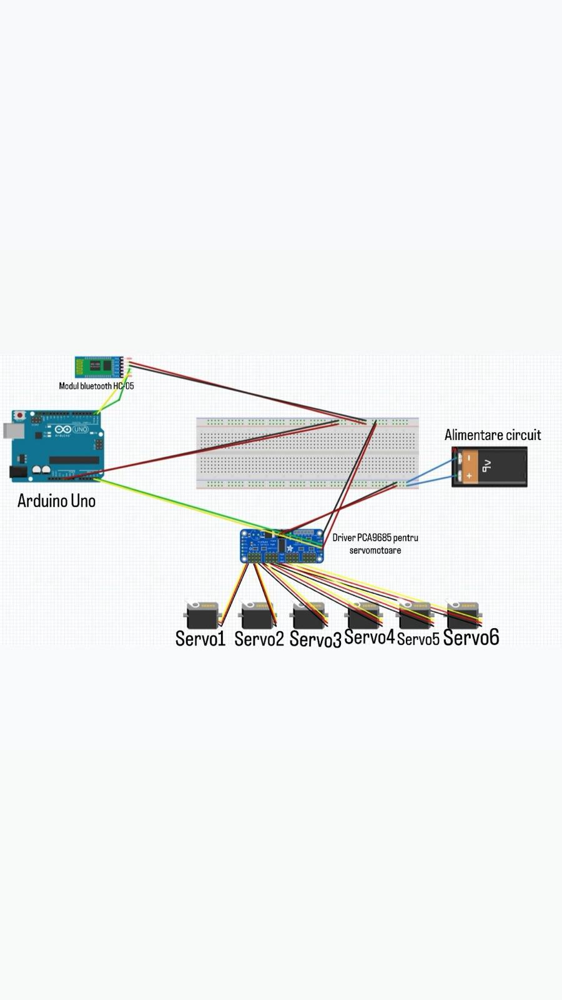
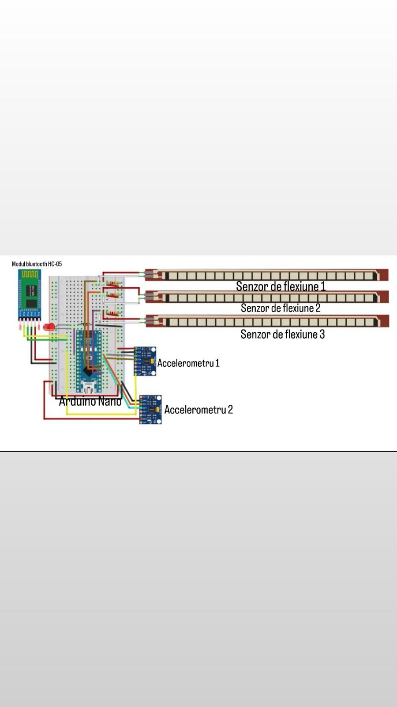

# ROBOT-ARM
## Gesture-Controlled Teleoperation Robotic Arm

This project implements a teleoperation system consisting of an anthropomorphic robotic arm controlled remotely by a sensory glove. By translating natural human hand and arm movements into mechanical actions, it creates a highly intuitive human-machine interface (HMI). This project serves as an accessible educational platform for robotics, with real-world applications extending to hazardous material handling, telemedicine, and the development of bionic prosthetics.

It is part of a university project for the Electrical Measurements and Sensors discipline. You can find the full documentation for the university project in the attached files, written in Romanian: [documentatie_robot_arm.pdf](documentatie_robot_arm.pdf).

### System Architecture and Demonstration

[Watch the Video Demonstration Here](https://www.youtube.com/watch?v=YOUR_DUMMY_VIDEO_ID)

The system operates via two independent modules communicating wirelessly over Bluetooth. The Control glove reads analog data from resistive flex sensors and two MPU6050 Inertial Measurement Units (IMUs). A built-in filtering algorithm processes these inputs to reduce sensor jitter before transmitting serial commands. The Execution arm receives these commands and uses a PCA9685 driver to accurately position six independent servomotors. 

### Hardware Schematics

Below are the electrical circuit diagrams for both the Execution Module and the Control Module. *(Ensure you upload the images to your repository with these exact filenames, or update the paths below to match your files).*

**Execution Module (Robotic Arm) Schematic:**

**Control Module (Sensory Glove) Schematic:**

### Usage Instructions (For End-Users)

If the hardware is already assembled and flashed, no software installation is required to operate the arm. 

1. Power on the Execution Module (Robotic Arm). Ensure the power supply for the PCA9685 servo driver is connected and stable.
2. Power on the Control Module (Sensory Glove).
3. Wait for the HC-05 Bluetooth modules to pair automatically.
4. Wear the glove. The system provides 6 Degrees of Freedom (6 DOF), mimicking your base rotation, shoulder, elbow, wrist (vertical and horizontal), and grip. 

### Build Instructions (For Contributors and Makers)

To build, compile, and modify this project locally, you will need the Arduino IDE and the following hardware components. The estimated total cost for the prototype is 465 RON.

**Hardware Bill of Materials (BOM):**
* 2x Arduino Uno or Nano compatible boards
* 3x Flex Sensors (connected via voltage dividers with 10kΩ - 30kΩ pull-down resistors)
* 2x MPU6050 Accelerometer/Gyroscope modules (Note: modify the AD0 pin to use addresses 0x68 and 0x69 for simultaneous I2C operation)
* 2x HC-05 Bluetooth Modules (configured in a crossover RX/TX setup)
* 6x MG996R Servomotors
* 1x PCA9685 16-channel PWM Driver

**Software Setup:**
1. Clone this repository.
2. Open the `.ino` files in the Arduino IDE.
3. Install the required libraries: `Wire.h` and `Adafruit_PWMServoDriver.h`.
4. Flash the Control code to the glove's Arduino and the Execution code to the arm's Arduino.

### Expectations for Contributors

Contributions to improve the filtering algorithms or hardware design are welcome. To keep the project organized:
* Please open an issue detailing the bug or feature request before submitting a pull request.
* Ensure all new code is properly commented.
* Squash your commits before submitting a pull request to keep the history clean.

### Known Issues

We are currently tracking a few hardware and software limitations. Please check this list before opening a new issue:

* **Biomechanical Coupling:** It is difficult to perfectly isolate human muscle movements. The software utilizes parametric detection filters, but involuntary muscle relaxation can still trigger unwanted commands. Operators must maintain a firm, stable position.
* **Bluetooth Data Overflow:** Fast, unisolated movements can generate a continuous stream of serial data, accumulating in the HC-05 buffer. This can exceed the processing capacity of the Execution module, resulting in system freezes or complete radio disconnection. The transmission rate has been artificially lowered to mitigate this, but further optimization is needed.
